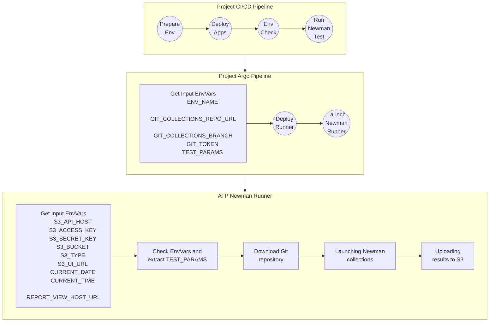

# Qubership Testing Platform Newman Collections Runner

## Description of CI/CD process

### Main flow



### Variables description

#### Input for Project Argo Pipeline

- __ENVIRONMENT_NAME__ - Environment name
- __ATP_TESTS_GIT_REPO_URL__ - Git repository URL
- __ATP_TESTS_GIT_REPO_BRANCH__ - Branch to clone
- __ATP_TESTS_GIT_TOKEN__ - Git access token
- __TEST_PARAMS__ - JSON which contains parameters for collections execution. See `TEST_PARAMS example` and `TEST_PARAMS description` section

#### Input for ATP Newman Runner

- __ATP_STORAGE_SERVER_URL__ - MinIO API host
- __ATP_STORAGE_USERNAME__ - S3 access key
- __ATP_STORAGE_PASSWORD__ - S3 secret key
- __ATP_STORAGE_BUCKET__ - S3 bucket name
- __ATP_STORAGE_PROVIDER__ - Storage type (`aws` or `minio` or `s3`)
- __ATP_STORAGE_SERVER_UI_URL__ - S3 UI URL
- __CURRENT_DATE__ - Optional. Format `YYYY-MM-DD`, example: `2025-07-30`
- __CURRENT_TIME__ - Optional. Format `HH:MM:SS`, example `23:45:12`

#### TEST_PARAMS Example

```json
{
  "collections":[
    "project_name/Acquire_Token.postman_collection.json",
    "project_name/Smoke_AgreementManagement.postman_collection.json"
  ],
  "env":"environment/dev_env.postman_environment.json",
  "env_vars":{
    "core_url":"http://core-project-123.k8s-dev123.k8s.test.somedomain.com",
    "conf-url":"http://configuration-service-project-123.k8s-dev123.k8s.test.somedomain.com",
    "cluster":".k8s-dev123.k8s.test.somedomain.com",
    "namespace":"project-name-ns123",
    "private-gw":"http://private-gateway-project-123.k8s-dev123.k8s.test.somedomain.com",
    "project":"project-name",
    "protocol":"https://",
    "public-gw":"http://public-gateway-project-123.k8s-dev123.k8s.test.somedomain.com",
    "tenant_name":"some_tenant"
  },
  "flags": [
    "--insecure",
    "--export-environment env1.yaml"
  ]
}
```

#### TEST_PARAMS description

The flags for launching Newman tools are listed below.

- __collections__ - List of relative paths to files with collections. See flag `newman run {relative path to collection}`
- __flags__ - Set of flag for execution. See flags `--insecure --export-environment env1.yaml`

## Reporting

During the collection run, reports are generated in four formats: CLI, JSON, HTML, and Allure.

- CLI - Performs logging to the console. Required for local debugging of the service itself, as well as debugging of the collection.
- JSON - This is a built-in Newman logger that writes results to a JSON file. It is convenient for automated parsing of results.
- HTML - A static interactive report includes an execution summary and pass rate, detailed information for each request (status, assertions, timings, sizes), request/response bodies, variables, and logs. Provides filters (e.g., “failed only”), search, collapsible sections, and (with history enabled) simple trend charts. Useful to open in a browser and publish as a CI artifact.
- Allure - A system for visually displaying the results of collection runs. Ideal for visual analysis of automated test results by humans.

## Local Build

This guide explains how to prepare your local machine to run the service and Newman tests with reports.

## 1) Prerequisites
- **Node.js LTS** (includes `npm`). Check:
  ```bash
  node -v && npm -v
  ```
- **Git** (to use Git Bash / PowerShell).

## 2) Install CLI utilities: `jq` and `s5cmd`
Recommended on Windows: install via **Scoop**¹
```powershell
# Install Scoop (if not installed)¹
Set-ExecutionPolicy -Scope CurrentUser RemoteSigned
iwr -useb get.scoop.sh | iex

# Install jq and s5cmd
scoop install jq s5cmd
```

Alternatives:
```powershell
# Winget
winget install jqlang.jq
winget install peak.s5cmd

# Chocolatey
choco install jq
choco install s5cmd
```

Verify:
```bash
jq --version
s5cmd --version
```

> **Git Bash note:** if commands aren’t visible, add Scoop shims to PATH:

## 3) Install project dependencies
In the repository root:
```bash
npm install
```

## 4) Newman reporters (Allure / json-summary / htmlextra)
If you see errors like “could not find <reporter>”, install Newman and reporters **globally** (quick fix for local dev):
```bash
npm i -g newman newman-reporter-allure newman-reporter-json-summary newman-reporter-htmlextra
```

## 5) Troubleshooting
- **`newman: could not find "<reporter>"`** → install reporters where Newman runs  
  (use the global command above, or add reporters to `devDependencies` and run with `npx`).
- **`jq: command not found`** → install via Scoop/Winget/Choco; re-open terminal.
- **`s5cmd: command not found`** → ensure it’s installed and visible in PATH (see note above).
- **Invalid JSON errors** → ensure `local_test_params.json` is valid UTF-8 without BOM and without comments/trailing commas.

## Local Run Collections without reports (via `local_start.sh`)

Below are minimal steps to run Newman collections locally via the prepared script.

### Pre-step: Prepare test data (REQUIRED)
Before running `local_start.sh`, you **must** prepare test data for conversion:
1. Create/modify file `tools/local_test_params.json` and fill it with test data
2. Download the collection(s) and environment(s) you need to run into the local-collection folder. The paths to the collections and environment(s) must match the contents of file `tools/local_test_params.json`


**Example content for `tools/local_test_params.json`:**
```
{"collections":["project_name/Acquire_Token.postman_collection.json""],"env":"environment/dev_env.postman_environment.json","env_vars":{"cluster":".k8s-dev123.k8s.test.somedomain.com","namespace":"project-name-ns123"},"flags":["--insecure"]}
```

### Quick Start
```bash
# from repo root

# Prepare test data
#    - create ./tools/local_test_params.json with project/job data (see example above)
# Then run
./local_start.sh
```

### What `local_start.sh` does
1. Enables strict bash mode (`set -euo pipefail`) and defines a helper to validate JSON via `jq`.
2. Loads and validates `tools/local_test_params.json` into `TEST_PARAMS`.   
3. Ensures `start_tests.sh` exists at repo root and executes it (actual Newman run and post-processing).

#### Example `tools/local_test_params.json`
Extended example (aligned with your format):
```json
{
  "collections":[
    "project_name/Acquire_Token.postman_collection.json",
    "project_name/Smoke_AgreementManagement.postman_collection.json"
  ],
  "env":"environment/dev_env.postman_environment.json",
  "env_vars":{
    "core_url":"http://core-project-123.k8s-dev123.k8s.test.somedomain.com",
    "conf-url":"http://configuration-service-project-123.k8s-dev123.k8s.test.somedomain.com",
    "cluster":".k8s-dev123.k8s.test.somedomain.com",
    "namespace":"project-name-ns123",
    "private-gw":"http://private-gateway-project-123.k8s-dev123.k8s.test.somedomain.com",
    "project":"project-name",
    "protocol":"https://",
    "public-gw":"http://public-gateway-project-123.k8s-dev123.k8s.test.somedomain.com",
    "tenant_name":"some_tenant"
  },
  "flags": [
    "--insecure",
    "--export-environment env1.yaml"
  ]
}
```
